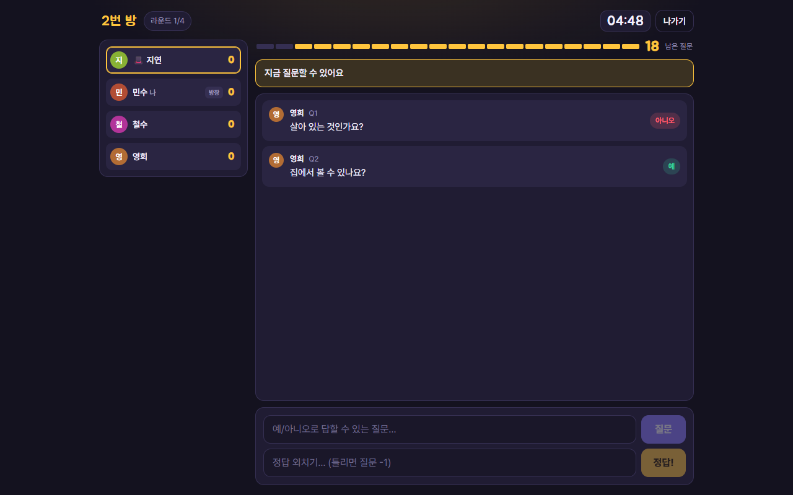

# 20고개 (Twenty Questions)

2~8명이 폰이나 PC로 함께 하는 **실시간 스무고개**입니다.
매 라운드 한 명이 출제자가 되어 단어를 정하고, 나머지가 예/아니오 질문 20개 안에 정답을 맞힙니다.
설치할 것 없이 브라우저로 접속해 닉네임만 넣으면 바로 시작합니다.

**지금 해보기 → https://twenty-questions-11fa.onrender.com**
(무료 서버라 15분간 아무도 없으면 잠듭니다. 첫 접속자만 1분쯤 기다리면 됩니다.)



## 이런 게임입니다

- 서버가 **방 3개**를 항상 열어 두고, 참가자는 첫 화면의 방 목록에서 하나를 골라 들어갑니다.
- **출제자**가 단어를 정하면(60초), 나머지가 **예 / 아니오**로 답할 수 있는 질문을 합니다. 라운드당 **20개**.
- 정답은 언제든 외칠 수 있습니다. 서버가 자동 판정하고, 틀리면 질문 1개를 소모합니다.
- 맞힌 사람 **+3점**, 출제자는 누가 맞히면 **+1점**, 아무도 못 맞히면 **+2점**.
- 모두가 한 번씩 출제하면 게임이 끝납니다.

## 사용 방법

### 참가하기

1. 주소를 열고 **닉네임**을 입력합니다 (12자 이내).
2. **방 목록**에서 비어 있거나 대기 중인 방을 골라 **들어가기**. 게임 중인 방은 잠겨 있습니다.
3. 친구에게 **몇 번 방**인지 알려 주세요. 같은 방에 들어오면 대기실 명단에 바로 나타납니다.

### 대기실 (방장)

- 첫 번째로 들어온 사람이 **방장**입니다.
- 참가자 카드를 **탭하면 그 사람이 첫 출제자**가 됩니다. 🎩 표시와 함께 전체 출제 순서가 아래에 미리 보입니다.
  고르지 않으면 입장 순서대로 진행합니다. **입장 순서대로** 버튼으로 되돌릴 수 있습니다.
- 2명 이상 모이면 **게임 시작**.

### 라운드

| 내가 출제자일 때 | 내가 추측자일 때 |
| --- | --- |
| 화면 위 상황 줄이 노랗게 바뀌고 단어 입력창이 뜹니다. 60초 안에 확정하세요. | 출제자가 단어를 고르는 동안 기다립니다. |
| 질문이 올라오면 바닥의 **예 / 아니오 / 애매함** 버튼으로 답합니다. | 상황 줄이 "지금 질문할 수 있어요"면 질문을 보냅니다. 누군가의 질문에 답변이 오기 전에는 다음 질문을 받지 않습니다. |
| 내 단어는 내 화면에만 보입니다. | **정답!** 입력창에 언제든 정답을 외칠 수 있습니다. 틀리면 질문 20칸 게이지가 하나 줄어듭니다. |

라운드가 끝나면 정답이 공개되고 15초 뒤 다음 출제자로 넘어갑니다(방장은 바로 넘길 수 있습니다).
모두가 한 번씩 출제하면 순위가 나오고, 방장이 **같은 사람들과 다시 하기**를 누르면 대기실로 돌아갑니다.

### 연결이 끊겼을 때

새로고침(F5)하거나 잠깐 연결이 끊겨도 **같은 자리로 돌아옵니다** (같은 브라우저 탭 기준).
5초 안에 돌아오면 진행 중인 게임·방장·출제자 역할이 그대로 이어집니다.
그보다 오래 끊긴 사람은 자리만 남겨 두고 "끊김"으로 표시하며, 출제 차례는 건너뜁니다.

## 직접 실행하기

```bash
npm install
npm run build     # 클라이언트 빌드 → dist/
npm start         # http://localhost:3001  (PORT 환경변수로 변경 가능)
```

같은 와이파이의 폰에서는 `http://<PC의 내부 IP>:3001`로 바로 접속할 수 있습니다.
서로 다른 네트워크에서 하려면 공개 주소가 필요합니다 → [배포와 외부 접속](docs/deploy.md).

```bash
npm run dev       # 개발: 서버(3001) + Vite(5173, 자동 새로고침)
npm test          # 게임 규칙 단위 테스트 + 실제 WebSocket 통합 테스트
```

## 문서

| 문서 | 내용 |
| --- | --- |
| [게임 규칙 (상세)](docs/rules.md) | 한 판의 흐름, 제한 시간·점수·길이 제한, 세부 규칙, 방 운영 방식 |
| [구조와 설계](docs/architecture.md) | 파일 맵, 서버 권위·좌석 복구·실시간 갱신, 메시지 프로토콜, 화면 구성, 테스트 |
| [배포와 외부 접속](docs/deploy.md) | Render 무료 플랜 배포, 다른 호스팅 비교, 같은 와이파이·터널 접속, 환경변수 |
| [알려진 제한과 위험](docs/limitations.md) | 메모리 상태, 공개 방, 수용 인원, 폰 화면 잠금, 도배·판정 한계 |

React + Vite 클라이언트, Node(`express` + `ws`) 서버. 서버 한 대가 화면과 실시간 통신을 모두 처리합니다.
